# Example Output

This page collects representative TransitionListener output from published
applications and from the shipped grid-scan example.

## Published applications

TransitionListener has already been used in several dark sector and
gravitational wave studies:

1. [Turn up the volume: listening to phase transitions in hot dark sectors](https://inspirehep.net/literature/1921562)  
   arXiv: [2109.06208](https://arxiv.org/abs/2109.06208), *JCAP* **02** (2022) 014.  
   This work introduced the original TransitionListener workflow for a dark
   Abelian Higgs model and used it to compute phase-transition dynamics,
   dilution effects, and the resulting gravitational wave signal for hot dark
   sectors.

   <p align="center">
     <a href="_static/2109.06208_example.png">
       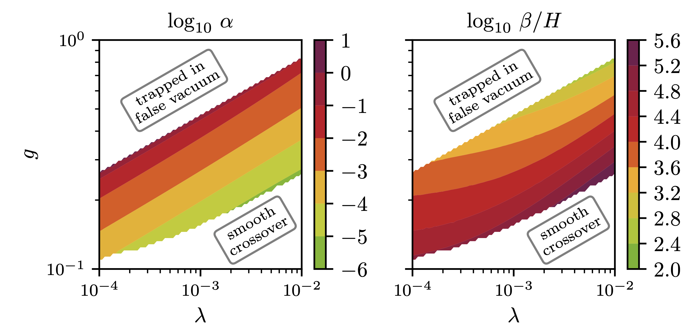
     </a>
   </p>

2. [Hunting WIMPs with LISA: correlating dark matter and gravitational wave signals](https://inspirehep.net/literature/2721943)  
   arXiv: [2311.06346](https://arxiv.org/abs/2311.06346), *JCAP* **05** (2024) 065.  
   Here TransitionListener was used to map the phase-transition and
   gravitational wave predictions of a dark $U(1)^\prime$ model onto the
   relic-density requirement, exposing the correlation between dark matter
   freeze-out and the milli-Hertz gravitational wave signal.

   <p align="center">
     <a href="_static/2311.06346_example.png">
       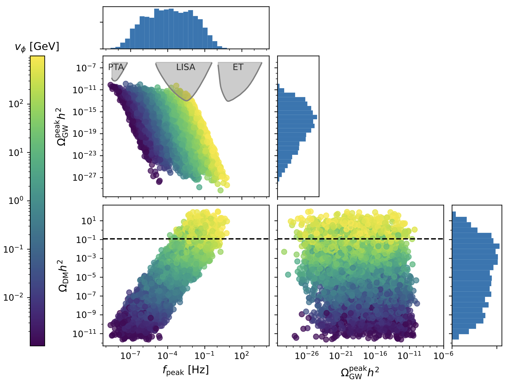
     </a>
   </p>

3. [Sub-GeV dark matter and nano-Hertz gravitational waves from a classically conformal dark sector](https://inspirehep.net/literature/2895297)  
   arXiv: [2502.19478](https://arxiv.org/abs/2502.19478), *JCAP* **08** (2025) 062.  
   In this project TransitionListener was applied to a classically conformal
   dark $U(1)^\prime$ model in order to identify parameter regions that
   simultaneously yield a PTA-scale gravitational wave signal, the observed
   dark matter abundance, and consistency with laboratory and cosmological
   constraints.

   <p align="center">
     <a href="_static/2502.19478_example.png">
       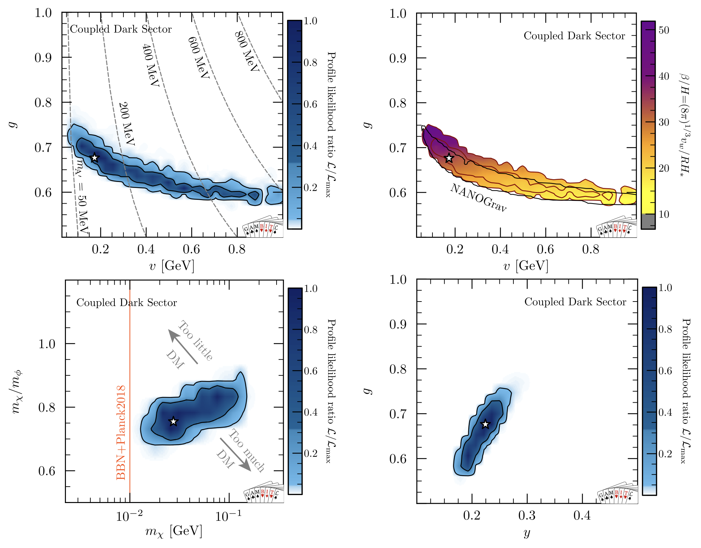
     </a>
   </p>

4. [Tuning the violins: dark sector phase transition models for the PTA signal](https://inspirehep.net/literature/3118127)  
   arXiv: [2602.09092](https://arxiv.org/abs/2602.09092).  
   This study
   used TransitionListener random scans and its UltraNest/PTA-likelihood
   interface to compare several dark-sector model classes and quantify how much
   tuning is required to explain the PTA signal.

The following figure is the $\alpha$--$(\beta/H)_{RH}$ comparison
plot discussed in the TransitionListener v2 paper and attributed there to the
last study above:

<p align="center">
  <a href="_static/example_output/fig14_alpha_betaH.png">
    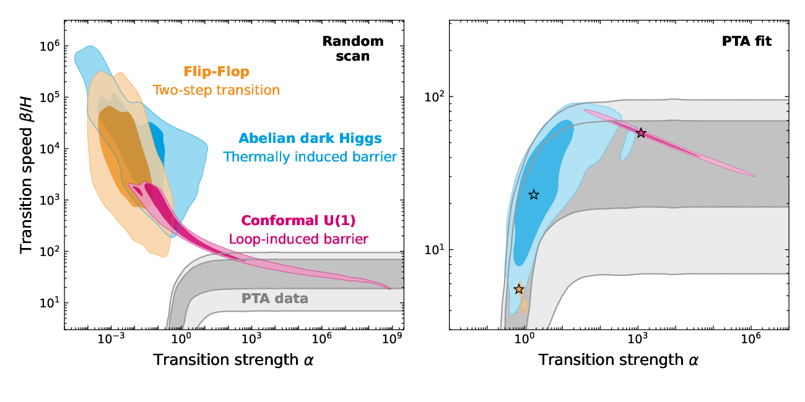
  </a>
</p>

It compares three dark-sector model classes in the
$\alpha$--$(\beta/H)_{RH}$ plane. The left panel shows generic
model predictions from TransitionListener random scans, while the right panel
shows the regions favored by PTA-informed nested sampling with the UltraNest
backend.

## Reproducing the shipped grid scan

The gallery below is generated from the example configuration
`examples/example_grid.yaml`, which runs a grid scan of the Abelian dark Higgs
model implemented in `models/TL_dark_U1.py`.

The scan settings are:

- x-axis parameter: `l` on a logarithmic grid from $10^{-4}$ to $10^{-2}$
- y-axis parameter: `v_GeV` on a logarithmic grid from $10^{6}$ to
  $10^{10}$ GeV
- fixed input: `g_tilde = 2.69`
- precision preset: `benchmark`
- grid size: `10 x 10`

Run it with:

```bash
tl -c examples/example_grid.yaml -j 10
```

The produced plots in `scans/example_grid/` are then copied into the docs as
PNG files for the gallery below.

## Transition strength and milestone temperatures

These panels summarize how the transition strength and the characteristic
temperatures vary across the two-dimensional parameter grid.

| | | | |
| --- | --- | --- | --- |
| [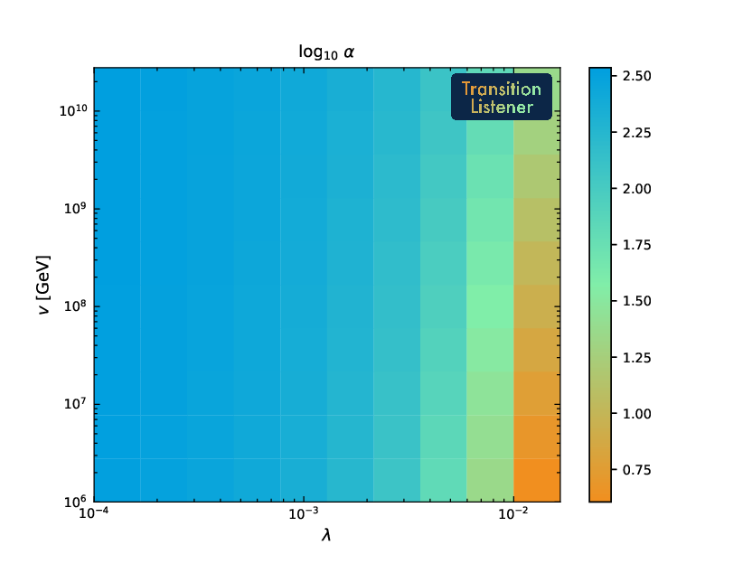](_static/example_output/log_plot_alpha.png) | [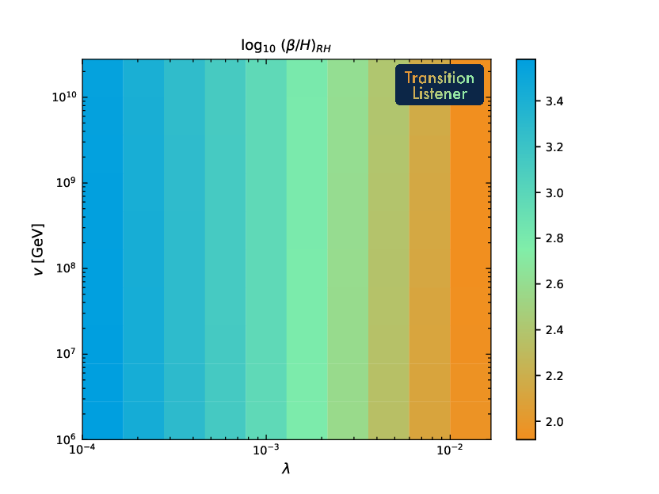](_static/example_output/log_plot_betaH_RH.png) | [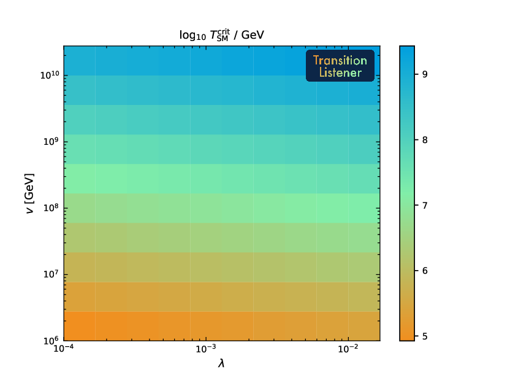](_static/example_output/log_plot_Tcrit_SM_GeV.png) | [](_static/example_output/log_plot_Tnuc_SM_GeV.png) |
| `alpha` | `betaH_RH` | `Tcrit_SM_GeV` | `Tnuc_SM_GeV` |
| [](_static/example_output/log_plot_Tperc_SM_GeV.png) | [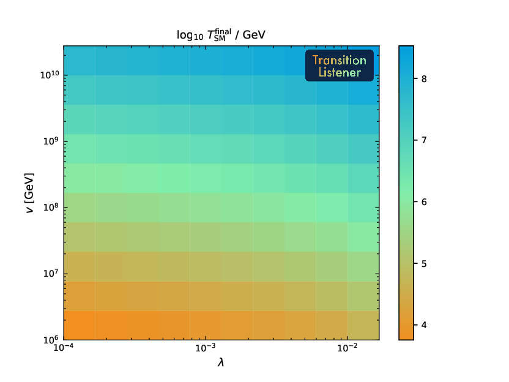](_static/example_output/log_plot_Tf_SM_GeV.png) | [](_static/example_output/log_plot_Treh_SM_GeV.png) |  |
| `Tperc_SM_GeV` | `Tf_SM_GeV` | `Treh_SM_GeV` |  |

## Plasma and thermodynamic quantities

These plots expose the background-fluid quantities that enter the
time-temperature relation and the macroscopic transition observables.

| | | | |
| --- | --- | --- | --- |
| [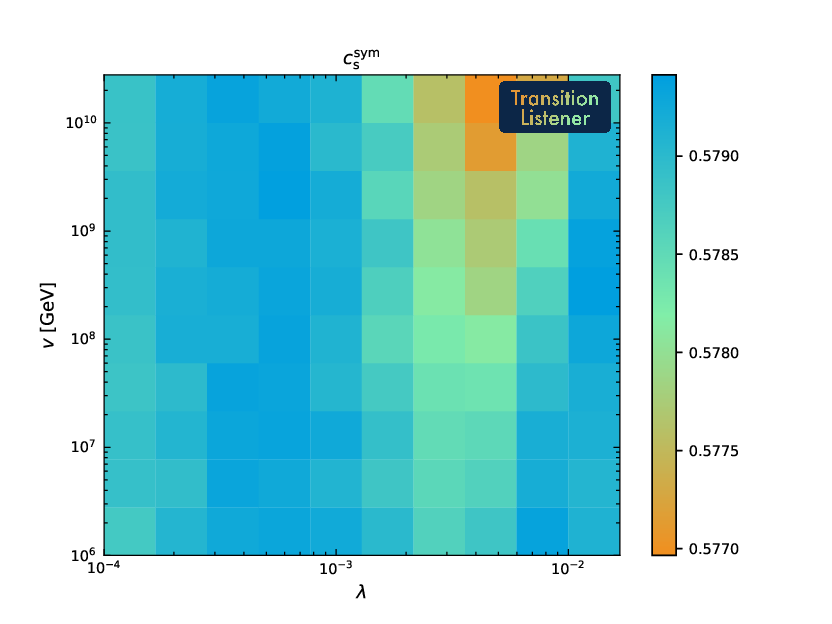](_static/example_output/lin_plot_c_s_sym.png) | [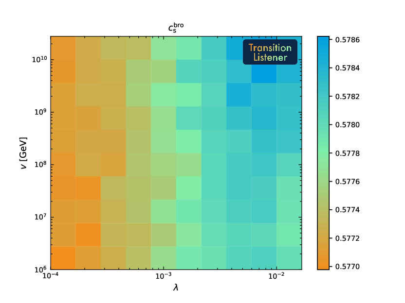](_static/example_output/lin_plot_c_s_bro.png) | [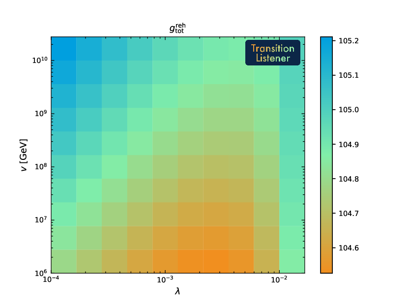](_static/example_output/lin_plot_g_eff_tot_reh.png) | [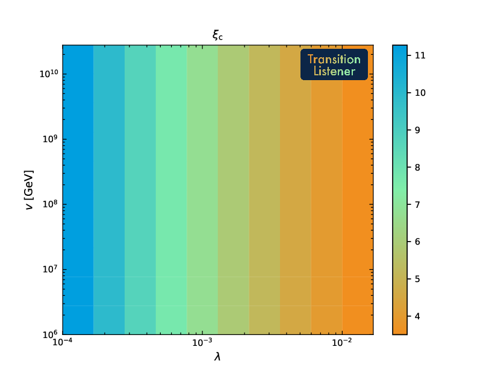](_static/example_output/lin_plot_xi_crit.png) |
| `c_s_sym` | `c_s_bro` | `g_eff_tot_reh` | `xi_crit` |

## Peak gravitational wave observables

These panels show the peak frequency and peak amplitude of the predicted
gravitational wave spectrum across the scan.

| | |
| --- | --- |
| [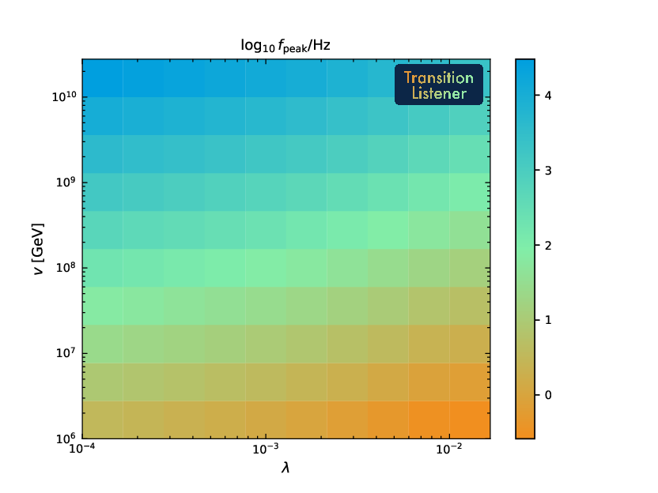](_static/example_output/Add_info_log10_f_peak_Hz.png) | [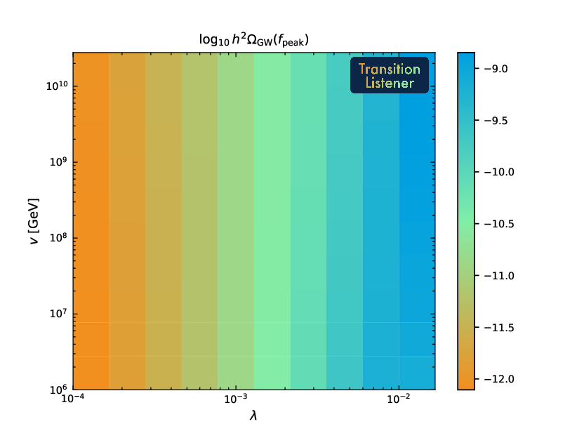](_static/example_output/Add_info_log10_h2OmegaGW_peak.png) |
| `log10_f_peak_Hz` | `log10_h2OmegaGW_peak` |

## Detector signal-to-noise maps

The final group illustrates how the predicted signals map into the
signal-to-noise ratios of selected future detectors.

| | | |
| --- | --- | --- |
| [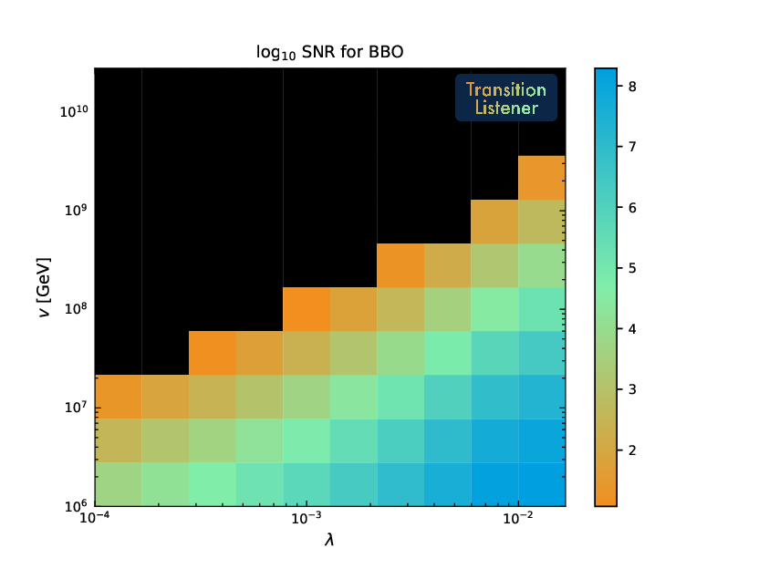](_static/example_output/SNR_BBO.png) | [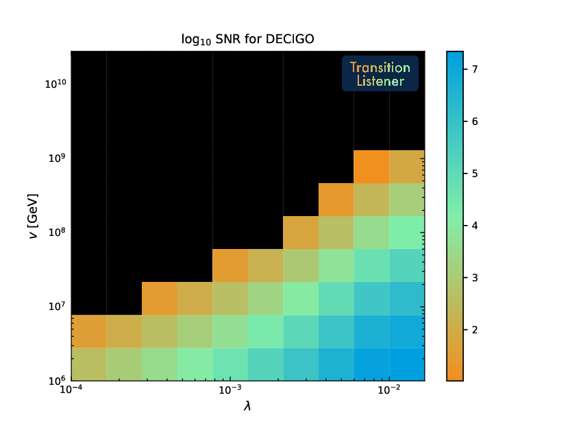](_static/example_output/SNR_DECIGO.png) | [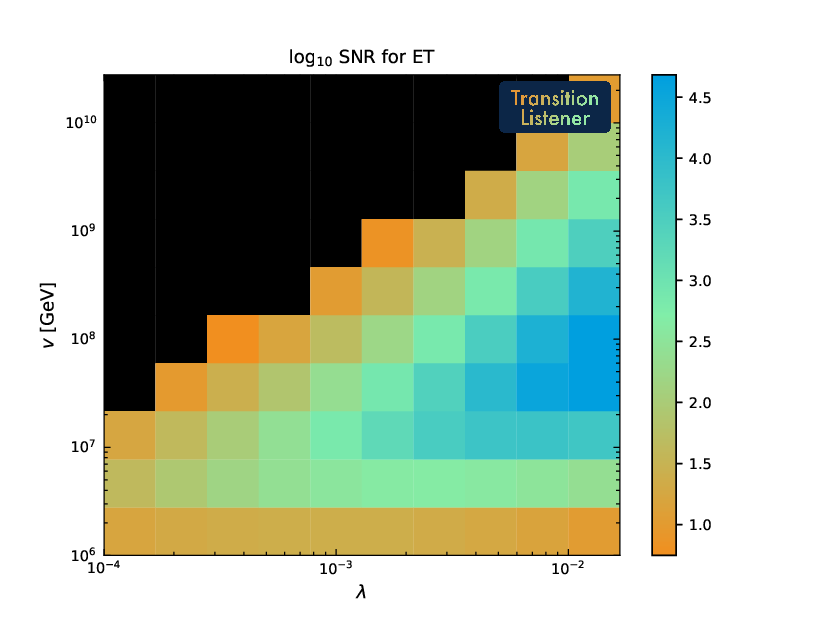](_static/example_output/SNR_ET.png) |
| `SNR_BBO` | `SNR_DECIGO` | `SNR_ET` |
