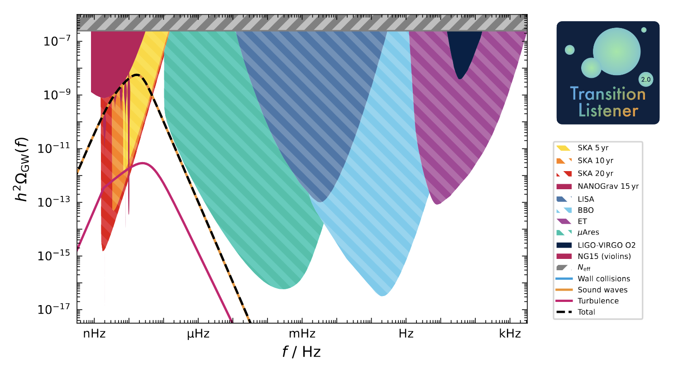

Getting started
===============

A first look at TransitionListener
----------------------------------

Using TransitionListener for studying the gravitational wave signal from
cosmological first-order phase transitions is really straightforward: Just
run 

.. code-block:: console

   $ tl -c examples/example_point.yaml -v

once you have installed TransitionListener. For the example above,
TransitionListener will create the following plot in the the folder
`scans/example_point/GW_spectrum.pdf`:

This is the gravitational wave spectrum produced by a first-order phase
transition in a simple extension of the Standard Model with an additional
:math:`U(1)` gauge symmetry with conformal invariance, as described in 
`arXiv:2502.19478 <https://arxiv.org/abs/2502.19478>`_.

Have a look into the configuration file `examples/example_point.yaml`. 
It starts as follows:

.. code-block:: yaml

   # Single-point scan for the conformal U(1) model
   # Run with: tl -c examples/example_point.yaml -v

   # ==================================================
   # Scan settings
   # ================================================== 
   Modelfile:
   models/TL_conformal_dark_u1.py

   Potential:
   specific_potential

   Scan:
   SinglePoint

   Parameters:
   g: 0.7
   v_GeV: 0.1
   y: 0.01

Change the model input parameters to see how the gravitational wave signal is affected! 
You can also leave out the `-v` flag to suppress verbose output in the
console.

More plots and diagnostics
--------------------------
Let's discover the various options of the ``yaml`` file for controlling
TransitionListener. The yaml file continues as follows:

.. code-block:: yaml

   # ==================================================
   # Output settings
   # ==================================================
   timeout: -1  # Timeout in seconds, -1 for no timeout
   format: "txt"  # either "txt" or "hdf5"
   output_path: "scans/example_point"
   description: "example point, conformal U(1) model"
   plot_description: "Example point, conformal $U(1)$ model"

This part specifies the output format and location as well as a timeout
for the run. Sometimes, e.g., when working on a cluster with limited
resources, it is useful to set a timeout for the run. The output format
can be either `.txt` files or `.hdf5` files. The output path specifies the
folder where all output files will be stored. The description and
``plot_description`` fields are used for labeling the output files and plots.
Note that the ``plot_description`` field supports LaTeX formatting.

The next part of the yaml file controls the plotting options:

.. code-block:: yaml

   # ==================================================
   # Plot settings
   # ==================================================
   # Additional plotting options for single point scans
   additional_plots:
      action:
         plot?: False
         Tmin_GeV: 0
         Tmax_GeV: 0.05
         phase_indices: [0, 1]
         n: 100

      potential:
         plot?: False
         T_GeV: 0.02
         phi_ranges_GeV: [0, 1]
         n: 100

      phases:
         plot?: False
         include_transitions?: False

      profileV:
         plot?: False
         field_index_1: 0
         field_index_2: 1

      energy_density:
         plot?: False
         Tmin_GeV: 0.01
         Tmax_GeV: 0.05
      
      dofs:
         Tmin_GeV: 0.01
         Tmax_GeV: 0.05
         plot?: False

      sensitivities:
         plot?: False

      profile:
         plot?: False

      percolation:
         plot?: False

      gw_spectrum:
         plot?: True

Each subsection under ``additional_plots`` toggles a specific figure via
its ``plot?`` flag and carries the configuration values needed for that plot.
Just try setting some of the ``plot?`` flags to ``True`` and re-run
TransitionListener to see the corresponding plots being created in the output
folder! If you want to learn more about the individual plots and their
configuration options, please refer to the :doc:`plots` section of the
documentation.

That's it! You are now ready to explore TransitionListener and its features. Have fun
studying cosmological phase transitions and their gravitational wave signals!

For detailed installation instructions and usage examples please refer to the following sections:

- Installation: :doc:`installation`
- Usage: :doc:`usage`

For more information, visit the documentation at
https://tasillo.de/TransitionListener_development or check out the code
repository at https://github.com/tasicarl/TransitionListener.
