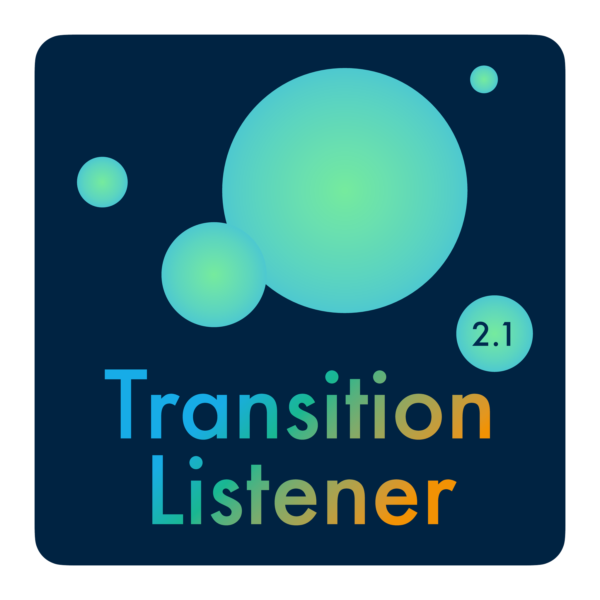

.. TransitionListener documentation master file, created by
   sphinx-quickstart on Mon Jun 30 10:39:44 2025.
   You can adapt this file completely to your liking, but it should at least
   contain the root `toctree` directive.

Welcome to TransitionListener’s documentation!
==============================================

**TransitionListener** is a tool for simulating and analyzing cosmological
first-order phase transitions and gravitational wave signals.

.. image:: https://img.shields.io/badge/license-GPLv3-blue.svg
   :target: https://www.gnu.org/licenses/gpl-3.0
   :alt: License: GPL v3

.. image:: https://img.shields.io/badge/sampler-UltraNest-lightgrey.svg
   :target: https://johannesbuchner.github.io/UltraNest/
   :alt: Sampler: UltraNest

.. image:: https://img.shields.io/badge/PTA%20likelihood-PTArcade-purple.svg
   :target: https://github.com/andrea-mitridate/PTArcade
   :alt: PTA likelihood: PTArcade

.. image:: https://img.shields.io/badge/arXiv-2109.06208-b31b1b.svg
   :target: https://arxiv.org/abs/2109.06208
   :alt: arXiv

.. image:: https://img.shields.io/badge/arXiv-2502.19478-b31b1b.svg
   :target: https://arxiv.org/abs/2502.19478
   :alt: arXiv

About
-----

TransitionListener is an open-source Python package designed to facilitate the
analysis of Standard Model extensions that feature
first-order phase transitions in the early universe. It provides tools to compute
the tunneling path of the scalar field(s), the thermodynamic parameters of the
phase transition, and the resulting gravitational wave spectrum. TransitionListener
also includes functionalities for scanning parameter spaces and visualizing results.

For a detailed list of capabilities, see the :doc:`features` page.

Usage
-----

* `Get started! <https://www.tasillo.de/TransitionListener_development/getting_started>`_
* Read the `full documentation <https://www.tasillo.de/TransitionListener_development/documentation>`_
* Have a look at the `GitHub repository <https://github.com/tasicarl/TransitionListener>`_

License and Citation
--------------------
If you use TransitionListener in your research, please cite the following papers:

- J. Matuszak, C. Tasillo, "TransitionListener v2.0 - Robust gravitational wave predictions for cosmological phase transitions", arXiv:2605.15259 [hep-ph].
- F. Ertas, F. Kahlhoefer, C. Tasillo, "Turn up the volume: listening
  to phase transitions in hot dark sectors", JCAP 02 (2022) 02, 014, arXiv:2109.06208 [astro-ph.CO].

GPLv3 (see LICENCE file). If you require another license, please contact us.

Contributors
------------

- Jonas Matuszak, developer of TransitionListener v2
- Carlo Tasillo, developer of TransitionListener v1 and v2
- Fatih Ertas, contributor to TransitionListener v1
- Safa Helal, beta tester of TransitionListener v2

.. toctree::
   :hidden:
   :maxdepth: 1
   :caption: Contents

   getting_started
   installation
   usage
   features
   method
   changelog
   contributing
   documentation
   plots
   example_output
   faq

.. toctree::
   :hidden:
   :maxdepth: 2
   :caption: API Reference

   api/TransitionListener
