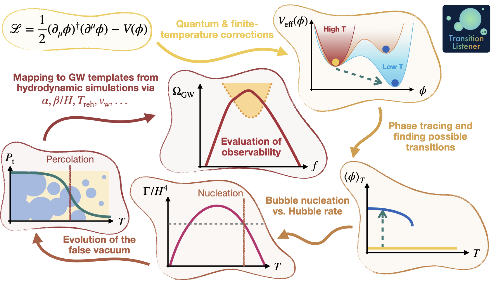

Method
======

The figure below summarizes the end-to-end workflow implemented in
TransitionListener.

TransitionListener takes a user-defined particle-physics model and turns it
into a prediction for the gravitational wave signal of a cosmological
first-order phase transition. Internally, the calculation proceeds through a
fixed sequence of physics modules coordinated by
:py:mod:`transitionlistener.interface.pipeline`.

From model definition to the effective potential
------------------------------------------------

The starting point is a model file that specifies the tree-level scalar
potential, the field content, counterterms, and the field-dependent mass
spectrum. In practice, user models inherit from
:py:mod:`transitionlistener.generic_potential`, which provides the common
infrastructure for evaluating the effective potential and its derivatives.

At finite temperature, the code constructs the one-loop, daisy-corrected
effective potential

.. math::

   V(\phi, T)
   =
   V_\text{tree}(\phi)
   +
   V_\text{CW}(\phi)
   +
   V_\text{ct}(\phi)
   +
   V_\text{T}(\phi, T)
   +
   V_\text{daisy}(\phi, T)
   +
   V_\text{rad}(T)
   -
   V_{T=0}(v)\,.

where :math:`V_\text{CW}` is the Coleman-Weinberg correction,
:math:`V_\text{ct}` contains the counterterms,
:math:`V_\text{T}` is the finite-temperature contribution, and
:math:`V_\text{daisy}` is the daisy-resummation term. The thermal integrals
:math:`J_\text{b}` and :math:`J_\text{f}` and the particle bookkeeping are
handled through
:py:mod:`transitionlistener.finiteT`,
:py:mod:`transitionlistener.particles`, and
:py:mod:`transitionlistener.thermodynamics`. The code supports the
Arnold-Espinosa and Parwani resummation prescriptions through the model
configuration.

Phase tracing and transition finding
------------------------------------

Once :math:`V(\phi, T)` is known, TransitionListener traces all
relevant local minima as functions of temperature using
:py:mod:`transitionlistener.phases`. The result is a temperature-ordered phase
history that records where phases appear, disappear, or become degenerate.

:py:mod:`transitionlistener.transitions` then inspects the traced phases and
identifies candidate first-order transitions between them. This step determines
which pairs of phases coexist over some temperature interval and therefore may
be connected by thermal tunnelling. Very weak transitions can be filtered out
already at this stage when the vacuum-energy release is too small to be
phenomenologically relevant.

Bounce action and nucleation history
------------------------------------

For each candidate transition, the tunnelling path in field space is
constructed with :py:mod:`transitionlistener.pathDeformation`. Along this path,
TransitionListener evaluates the three-dimensional Euclidean bounce action
:math:`S_3(T)` using :py:mod:`transitionlistener.tunneling1D`.

The bounce action determines the thermal bubble-nucleation rate,

.. math::

   \Gamma(T)
   =
   T^4
   \left(\frac{S_3(T)}{2\pi T}\right)^{3/2}
   \exp\!\left[-\frac{S_3(T)}{T}\right].

This quantity enters the nucleation and percolation analysis in
:py:mod:`transitionlistener.bubbledynamics`. The code first builds an initial
estimate of the percolation regime and then solves the percolation integral,
either with a fixed temperature grid or with an adaptive ODE-based method.

The central quantity is the fraction of space that has converted to the true
vacuum,

.. math::

   P_\mathrm{t}(T) = 1 - \exp[-I(T)]\,,

where :math:`I(T)` is the percolation integral. In the final step of the
algorithm, TransitionListener iterates this computation self-consistently so
that the changing vacuum composition feeds back into the Hubble rate and into
the temperature evolution. This is also the stage where reheating and the
completion of the transition are determined.

Macroscopic transition observables
----------------------------------

After the nucleation history has converged, the module
:py:mod:`transitionlistener.transitionObservables` computes the macroscopic
quantities that characterize the phase transition. These include the milestone
temperatures such as the nucleation, percolation, final, and reheating
temperatures, together with the transition-strength and time-scale measures
used in gravitational wave calculations.

The key outputs are the transition strength :math:`\alpha`, the inverse
duration :math:`\beta/H`, the mean bubble separation :math:`RH`, and the
bubble wall velocity :math:`v_\mathrm{w}`. Hydrodynamic response and efficiency
factors are obtained with :py:mod:`transitionlistener.hydrodynamics`, while the
background thermodynamics relies on the phase-dependent energy density,
pressure, and effective relativistic degrees of freedom.

Gravitational wave prediction and observability
-----------------------------------------------

The macroscopic observables are then passed to
:py:mod:`transitionlistener.gwfopt`, which evaluates the gravitational wave
spectrum from the relevant production channels according to the selected
template settings. If several first-order transitions occur, the strongest one
is used for the default gravitational wave prediction.

Finally, :py:mod:`transitionlistener.observability` compares the predicted
spectrum to the sensitivity of current and future detectors. This last stage
turns the microphysical model input into phenomenological quantities such as
signal-to-noise ratios, detector reach, and PTA likelihood-based summaries.
