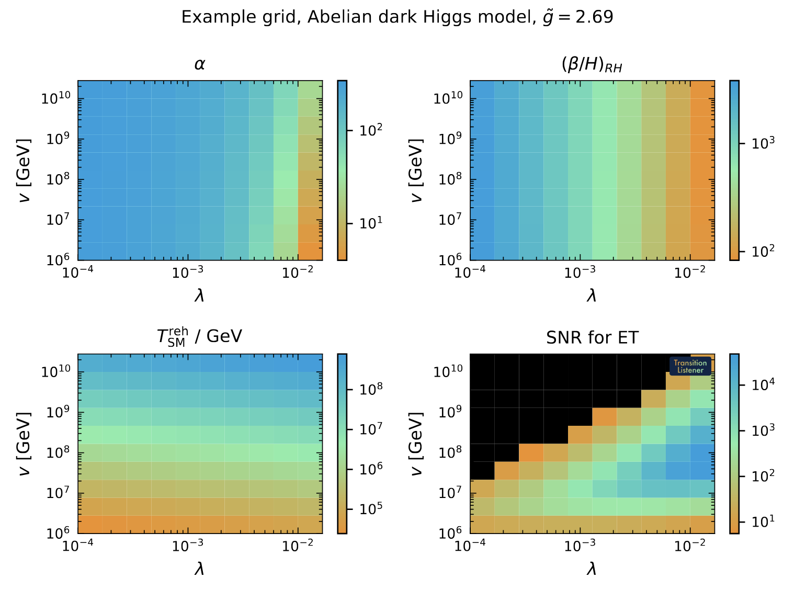
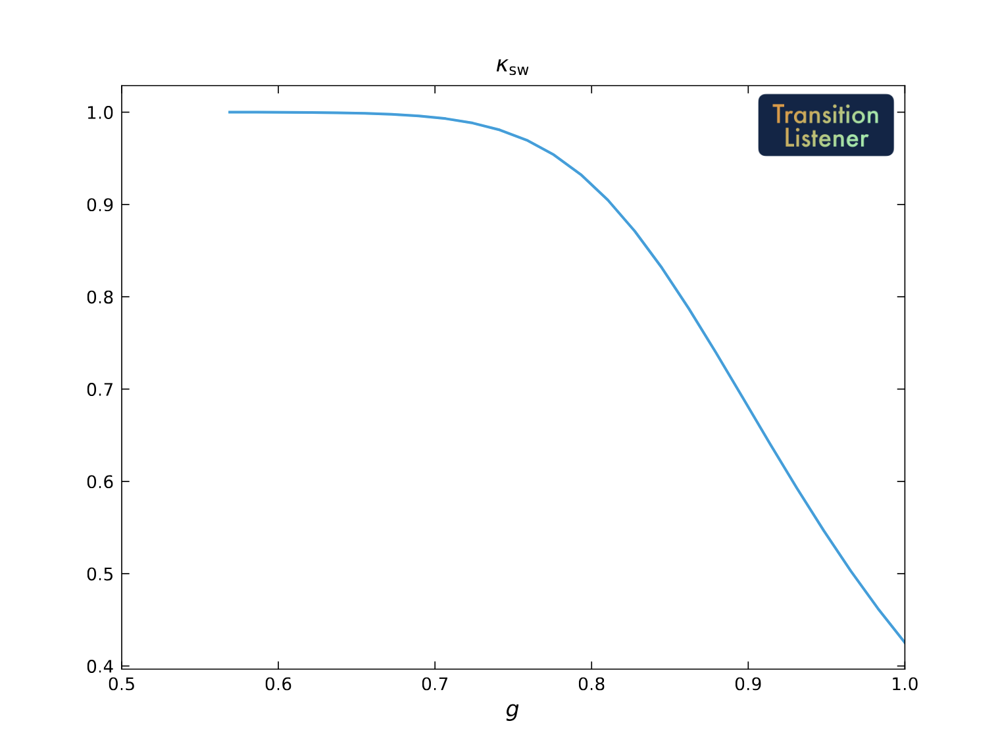

Usage
=====

After ``pip``-installing TransitionListener, you can easily start using it
from your terminal. It is really simple to get started.

Configuration files
-------------------

All it takes is a human-readable configuration file, a ``.yaml`` file, which
specifies the model parameters, scanning ranges, and desired outputs.

You can find example configuration files in the `config/` directory of the
TransitionListener repository.

Single point evaluation
-----------------------

Let's say you have created a configuration file named `example_point.yaml` in the `example/` directory,
which specifies a benchmark point which you would like to know of whether it features a
first-order phase transition and what gravitational wave signal it produces.

You can run TransitionListener using the command line interface as follows:

.. code-block:: console

   $ tl -c examples/example_point.yaml -v

This command will execute TransitionListener with the specified configuration
file and enable verbose output. This will
print detailed information about the progress of the computation to the terminal.
When the computation is finished, the results
will be saved to the scans directory to a subfolder as specified in the configuration
file. In there you will find 
various output files, including ``0_Input_params.txt`` reminding you of the chosen input parameters,
``1_All_params.txt`` showing all computed parameters during the performed run, as well as
``2_Observability.txt`` containing the computed observability metrics. Further, additional
plots and log files including information about the computation process are saved there.

Grid and line scans
-------------------

If you want to run a small grid scan using the command line interface, you can use the following command:

.. code-block:: console

   $ tl -c examples/example_grid.yaml -j 10

The -j flag specifies the number of parallel jobs to run. Here we took 10 jobs.
This can speed up the scan significantly on multi-core machines. The above scan takes
a only a couple of minutes on a modern machine.
After the scan is complete, the results will be saved in the specified output
directory. You will find various output files, including
also the following overview plot.

On top of that, you will find close to 200 intermediate results saved in the output directory,
in the form of ``.txt`` files as well as ``.pdf`` plots.

Alternatively, you can also run an example line scan using the following command:

.. code-block:: console

   $ tl -c examples/example_line.yaml -j 5

This will perform a line scan over the specified parameter range with 5 parallel jobs.
The results will be saved in the output directory as specified in the configuration file.
The output is very similar to the grid scan case. For instance, you will find the
efficiency factor for converting released vacuum energy to bulk fluid motion among them:

Percolation algorithm controls
------------------------------

TransitionListener exposes two percolation solvers through the configuration:

- ``adaptive_step_size`` is the default. It does not require a nucleation-
  temperature seed and instead builds an adaptive support bank for
  :math:`P(T)`
  on the fly: the controller scouts the bubble-nucleation-rate peak, protects
  the high-temperature onset where the bubble nucleation rate is still very small,
  and then refines the temperature interval in which the true-vacuum fraction
  increased from zero to one. It further rejects points
  with unresolved bounce action jitter. The percolation integral is solved via
  an ODE solver (``percolation_integral_method = "ode"``) using the
  time-temperature relation in the false vacuum dervied from the
  speed of sound in that phase. 
- ``fixed_step_size`` is the an alternative solver of the percolation
  integral, which sometimes gives more robust results when the adaptive
  step size solver fails due to numerical instabilities. It
  evaluates the percolation integral on a precomputed ``TSYM`` grid of size
  ``percolationConf.n_action`` (default ``30``; ``n_action = 100`` gives the
  high-resolution benchmark setup). As it requries a nucleation temperature as
  as seed, which first needs to be computed, it is a bit slower on average
  and cannot deal with cases in which the :math:`\Gamma = H^4` condition can never
  be satisfied, i.e. for extremely slow phase transitions. For most cases,
  this mode is however a good alternative, in case any unexpected behavior occurs
  during the percolation computation.

The most important controls are:

- ``percolation_algorithm_mode``: ``adaptive_step_size`` or
  ``fixed_step_size``.
- ``percolation_integral_method``: ``ode`` (default) or ``double_integral``
  for diagnostics.
- ``percolation_time_temperature_mode``: ``sound_speed`` (default) uses the
  symmetric-phase :math:`c_s^2(T)` and the cosmological scale-factor ratio
  :math:`a(T)/a(T_\mathrm{hot})` inside the percolation integrand. ``bag``
  falls back to the :math:`c_s^2 = 1/3` limit (no scale-factor weighting).
- ``percolationConf.n_action``: fixed ``TSYM`` support count for
  ``fixed_step_size`` runs.
- ``percolation_n_action_min``, ``percolation_n_action_increment``,
  ``percolation_n_action_max``, ``percolation_max_action_temperatures``,
  ``percolation_maxit``: support-bank controls for ``adaptive_step_size``.
- ``percolation_jitter_GH4_threshold``: the bounce-rate jitter detector
  (in :math:`\log_{10}(\Gamma/H^4)`) -- default ``1.0``; raise to ``2.0`` or so on
  models with very steep, deeply supercooled action profiles.
- ``percolation_max_log10_rate_step``: largest change of
  :math:`\log_{10}(\Gamma/H^4)` allowed between neighbouring support points --
  default ``12.0``. Intervals above it are refined before jumps in :math:`P`,
  because the percolation integral interpolates the logarithm of the rate and
  cannot resolve a rise that happens inside one interval. Zero switches the
  criterion off.
- ``percolation_acc_tperc``, ``percolation_acc_tfinal``,
  ``percolation_acc_rh``: refinement and stopping controls for
  ``adaptive_step_size``.

All of these can be set globally in the YAML configuration or directly in a
model file via ``setConfigParameters()`` when model-specific defaults are
desired. The default configuration uses ``adaptive_step_size`` with the
``ode`` / ``sound_speed`` integral, so most users do not need to touch any
of these knobs.

Precision modes
---------------

The tracing and tunnelling precision presets are configurable through
``precision_mode``:

- ``default`` -- vanilla settings.
- ``robust`` -- tighter phase tracing only.
- ``xtrace`` -- still tighter tracing (very small ``dtstart``, ``dtmin``).
- ``tunneltight`` -- default tracing plus tighter bounce path-deformation
  tolerances.
- ``benchmark`` -- tightens both tracing and tunnelling. Note: While being the
  most precise mode, it can be computationally expensive, with runtimes of a single
  computation of over one hour, in the case of multi-dimensional scalar potentials.

Radiation baths
---------------

Radiation that is not part of the potential belongs to one of two baths, set
in the model's ``init``:

- ``kin_coupled_e_geff`` and ``kin_coupled_p_geff`` (default: the Standard
  Model) describe radiation in thermal contact with the fields of the
  potential. Together they form the transitioning sector, which is reheated
  inside the bubbles.
- ``kin_decoupled_e_geff`` and ``kin_decoupled_p_geff`` (default: empty)
  describe radiation that is not. It is not reheated inside the bubbles, keeps
  the temperature of the surrounding false vacuum and enters the expansion rate
  and the redshift of the gravitational-wave spectrum. With
  ``pot.config.gwConf.coupled_hydrodynamics = True`` (the default) it also moves
  with the fluid and enters the hydrodynamics and the strength ``alpha``.

For a dark sector decoupled from the Standard Model, move ``e_geffSM`` and
``p_geffSM`` from the coupled to the decoupled bath, set the coupled bath to
zero, and set ``pot.config.gwConf.coupled_hydrodynamics = False``, so that the
Standard Model does not enter the hydrodynamics either. TL takes the bath whose
tables are ``e_geffSM`` as the Standard Model bath; if the tables are wrapped,
set ``self.SM_bath = "decoupled"`` (or ``"coupled"``) in the model. It warns if
both baths hold ``e_geffSM``. A model whose potential contains Standard Model
fields (flagged ``is_SM``, e.g. the 2HDM) has the Standard Model in its
transitioning sector; TL then refuses a decoupled Standard Model, while other
radiation, e.g. of a dark sector, can still go into the decoupled bath.

Both baths share the temperature before the transition, so ``Tnuc_SM_GeV`` and
``Tperc_SM_GeV`` apply to both. ``Treh_SM_GeV`` is the temperature of the
Standard Model bath at reheating, which happens at percolation: the reheated
temperature if the Standard Model is coupled, ``Tperc`` if it is decoupled.
``Treh_DS_GeV`` is the reheating temperature of the transitioning sector.
``g_eff_tot_reh`` and ``h_eff_tot_reh`` sum the fields of the potential, the
coupled bath and the decoupled bath, each weighted by its temperature ratio to
the Standard Model bath to the fourth and third power. The redshift assumes
that the energy and entropy of the dark sector end up in the photon bath
without entropy injection (dilution factor ``D = 1``). Two simplifications
apply: the decoupled bath is evaluated at the temperature of the transitioning
sector until the transition, although the two can drift apart where the
degrees of freedom of either change, and the evolution of the temperature ratio
after the transition is not modelled. For the same reason a decoupled bath is
only consistent for the first of several transitions: after it, the bath is
colder than the transitioning sector.

Random and nested sampling scans
--------------------------------
You can also run a random scan by using the following command:

.. code-block:: console

   $ tl -c examples/example_random_conformal.yaml -j 10

This will perform a random scan over the specified parameter ranges with 10
parallel jobs. The results will be saved in the output directory in a ``.csv`` file.
You can use this file 
to analyze the results further or visualize them using your preferred plotting tools.

If you are interested in performing a nested sampling scan using ``mpi`` for
parallelization you can use the following command:

.. code-block:: console

   $ mpiexec -n 16 tl -c config/example-nested-scan.yaml

This will run a nested sampling scan with 16 parallel processes.
The results will again be saved in a ``.csv`` file in the specified output directory.

For detailed installation instructions and usage examples please refer to the following sections:

- Installation: :doc:`installation`
- Usage: :doc:`usage`

For more information, visit the documentation at
https://tasillo.de/TransitionListener_development or check out the code
repository at https://github.com/tasicarl/TransitionListener.
